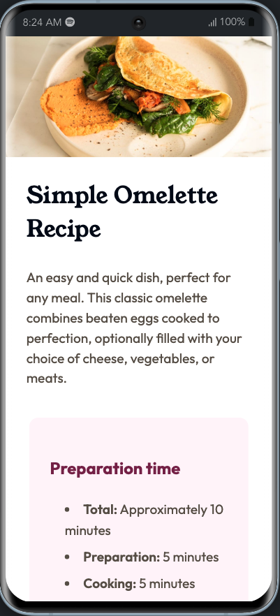
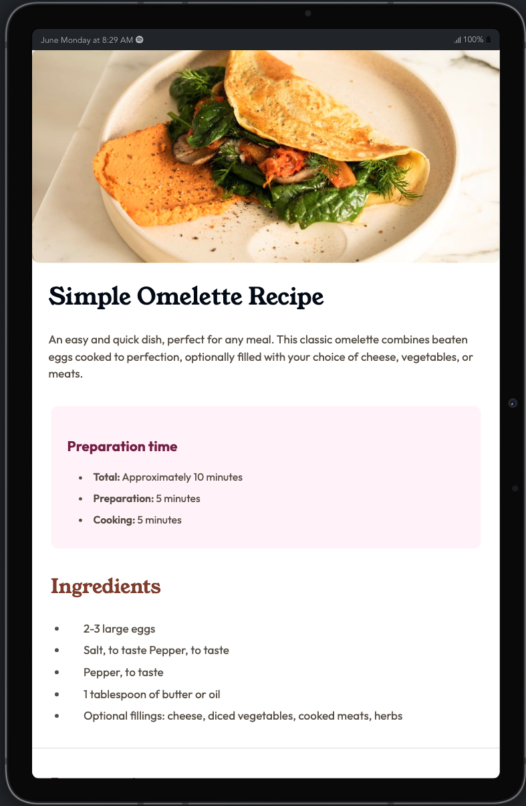

# Frontend Mentor - Recipe page solution

This is a solution to the [Recipe page challenge on Frontend Mentor](https://www.frontendmentor.io/challenges/recipe-page-KiTsR8QQKm). Frontend Mentor challenges help you improve your coding skills by building realistic projects.

## Table of contents

- [Overview](#overview)
  - [Screenshot](#screenshot)
  - [Links](#links)
- [My process](#my-process)
  - [Built with](#built-with)
  - [Continued development](#continued-development)
  - [Useful resources](#useful-resources)
- [Author](#author)

## Overview

<table>
  <tr>
    <td>First Screen Page</td>
     <td>Holiday Mention</td>

  </tr>
  <tr>
    <td></td>
    <td></td>

  </tr>
 </table>
 

### Links

- Solution URL: [Add solution URL here](https://your-solution-url.com)
- Live Site URL: [Add live site URL here](https://your-live-site-url.com)

## My process

### Built with

- CSS custom properties
- Flexbox
- Mobile-first workflow
- [Vite](https://vitejs.dev/) - Frontend Tooling
- [Shadcn-ui](https://ui.shadcn.com) - UI components
- [TailwindCss](https://tailwindcss.com/) - For styles

### Continued development

Use this section to outline areas that you want to continue focusing on in future projects. These could be concepts you're still not completely comfortable with or techniques you found useful that you want to refine and perfect.

### Useful resources

- [stackoverflow](https://stackoverflow.com/questions/24319505/how-can-one-display-images-side-by-side-in-a-github-readme-md) - This helped me for centered images on markdown
- [medium](https://medium.com/@josephat94/building-a-simple-react-hook-to-detect-screen-size-404a867fa2d2) - This tell me how to create custome hooks to detect screen size

## Author

- Website - [rio rifaldi](https://riorifaldi-portofolio.vercel.app/)
- Frontend Mentor - [rio-rifaldi](https://www.frontendmentor.io/profile/rio-rifaldi)
- Twitter - [riorifaldi2004](https://x.com/riorifaldi2004)
